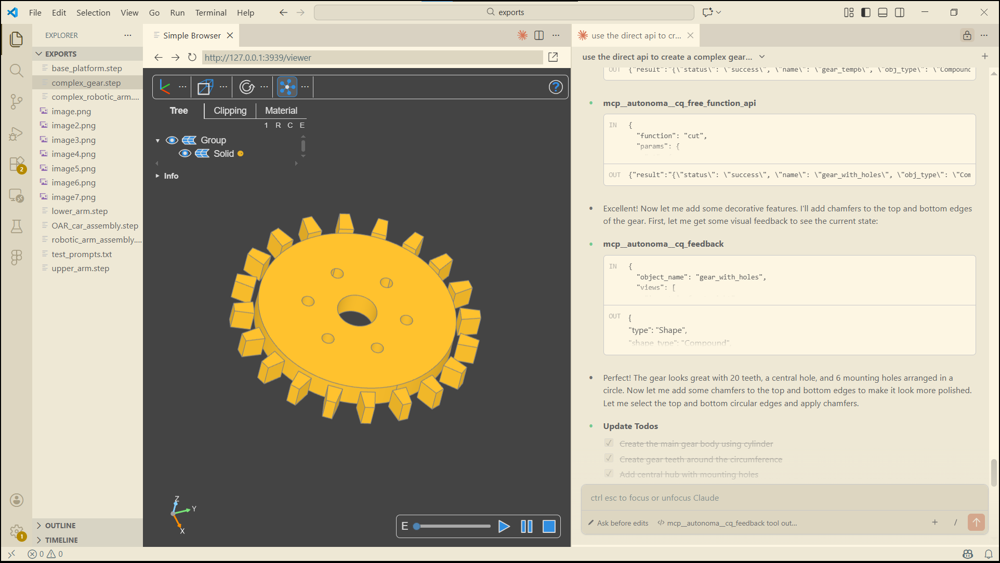
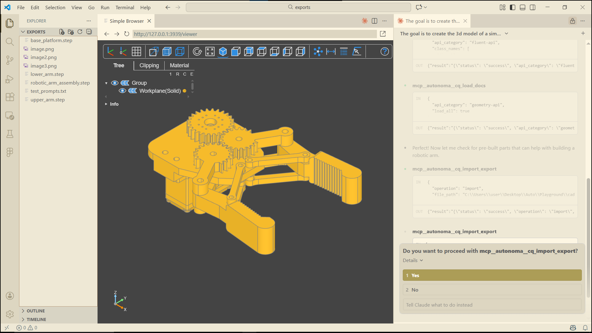
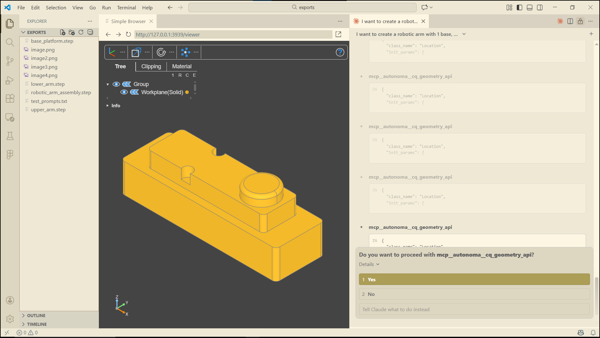
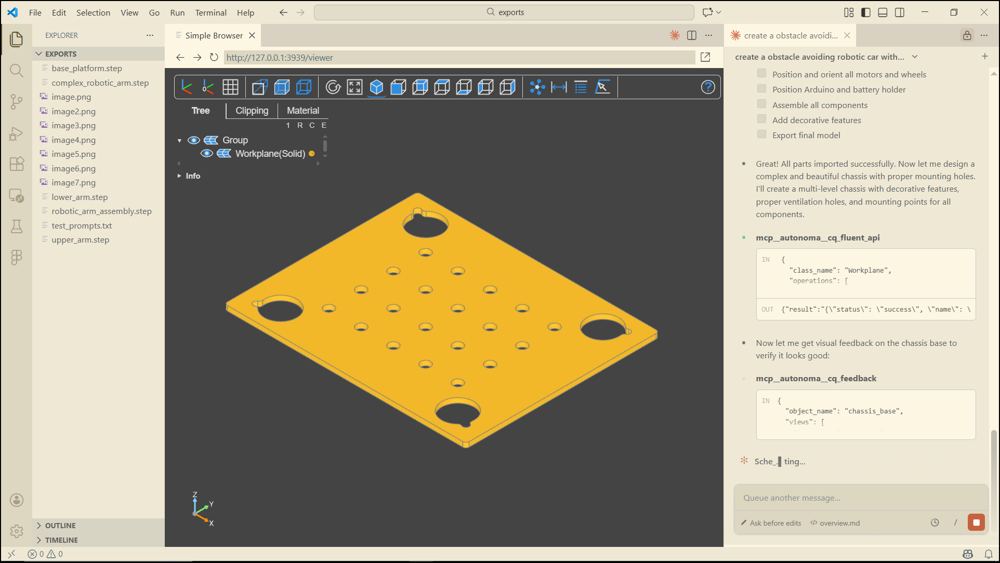
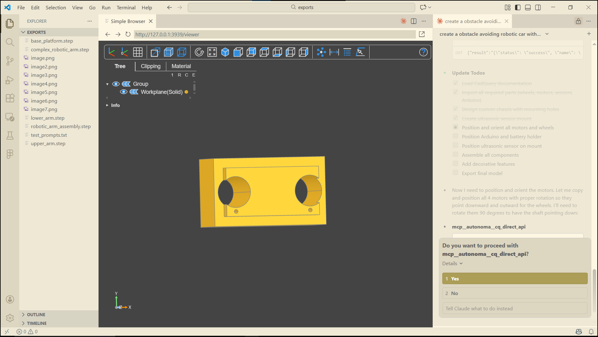
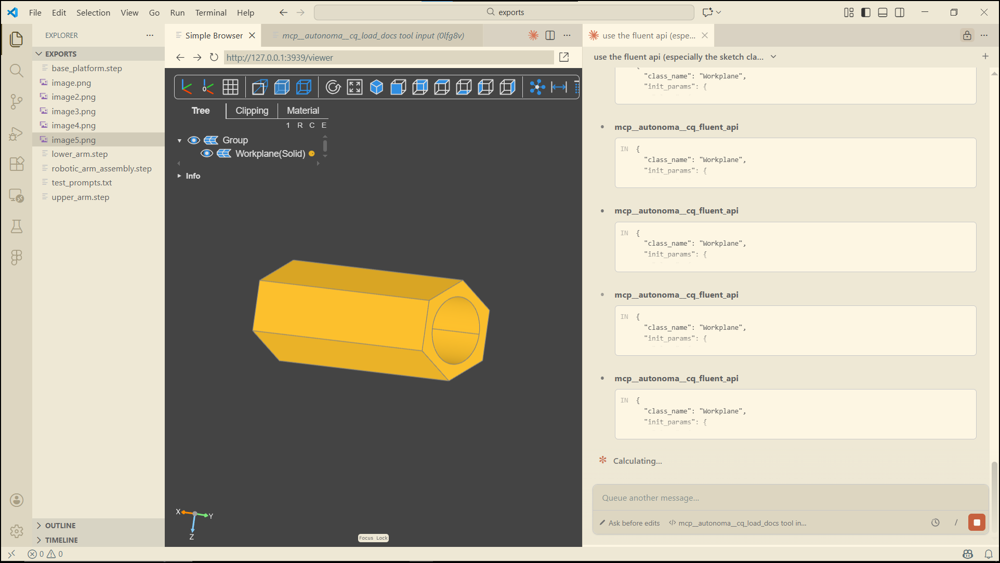
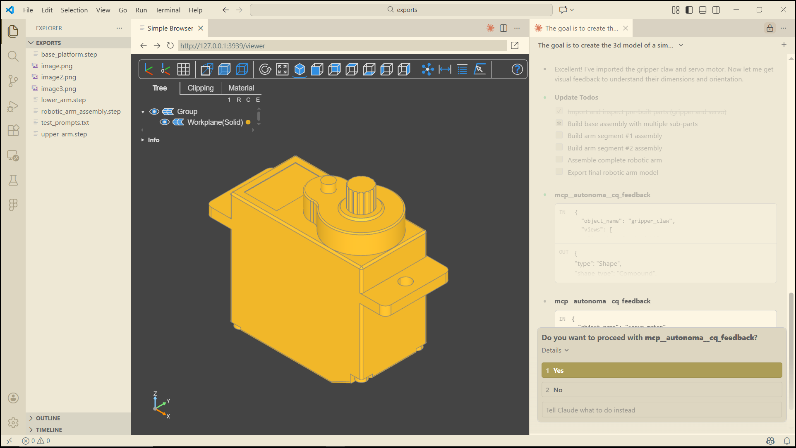
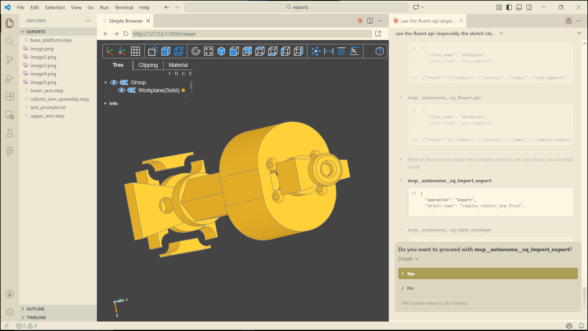
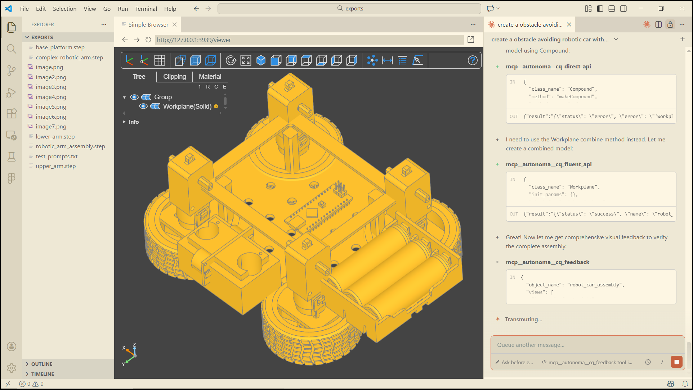
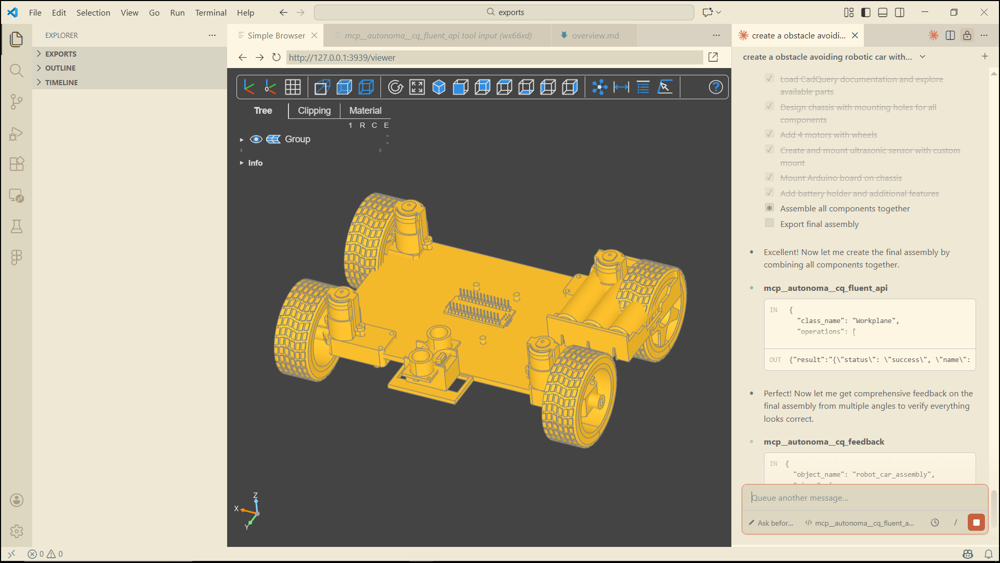

# CadQuery MCP Server

> **Give AI assistants full programmatic control over CadQuery for 3D CAD modeling — no GUI required.**


---

CadQuery MCP Server exposes the full CadQuery Python library as a [Model Context Protocol](https://modelcontextprotocol.io/) server, giving AI assistants like Claude a complete toolkit for parametric 3D CAD design. The AI can iteratively construct complex parts, multi-body assemblies, and mechanical components — with visual feedback at every step — entirely through tool calls, with no human in the modeling loop.

---

## Demo

### Video

[](https://youtu.be/TlQVlgVZJVA)

### Pictures











---

## Features

- **Full CadQuery coverage** — Workplane fluent API, Sketch, Assembly, direct geometry construction, free functions, and selectors are all available as MCP tools
- **Iterative visual feedback** — render PNG or SVG snapshots from any of 10 standard views (orthographic + isometric) after every modeling step, keeping the AI grounded in the actual geometry
- **Persistent session state** — objects persist across requests with named references, a parent/child hierarchy, and a 50-step undo/redo stack
- **20+ geometric selectors** — filter faces, edges, vertices, and wires by direction, radius, area, length, proximity, type, and more
- **Import/export** — read and write STEP files; export Assemblies with full constraint resolution
- **Built-in documentation loader** — the AI loads its own API reference on demand, reducing hallucinations and invalid method calls
- **Optional live viewer** — integrates with `ocp_vscode` for real-time 3D preview alongside the AI session
- **Zero-config transport** — runs over stdio; no port, no daemon, no setup beyond `python server_12.py`

---

## How It Works

```
┌─────────────────────┐      MCP (stdio)      ┌──────────────────────────┐
│   AI Client         │ ◄──────────────────► │  CadQuery MCP Server     │
│  (Claude Desktop,   │                       │                          │
│   custom agent...)  │                       │  FastMCP framework       │
└─────────────────────┘                       │  │                       │
                                              │  ├─ Session State        │
                                              │  │   (named objects,     │
                                              │  │    undo/redo stack)   │
                                              │  │                       │
                                              │  └─► CadQuery Engine     │
                                              │       (OCCT kernel)      │
                                              └──────────────────────────┘
```

Each MCP tool call targets a specific layer of CadQuery's API. The AI chains calls together, inspects results through `cq_feedback`, and iterates until the geometry is correct — the same workflow a human engineer would follow in a script, but fully automated.

---

## Tools Reference

| Tool | Description |
|------|-------------|
| `cq_fluent_api` | High-level chainable modeling: `Workplane`, `Sketch`, and `Assembly` operations. The primary tool for most CAD tasks. |
| `cq_direct_api` | Low-level direct constructors for `Shape`, `Solid`, `Face`, `Wire`, `Edge`, `Vertex`, and compound types. |
| `cq_geometry_api` | Mathematical primitives: `Vector`, `Plane`, `Location`, `Matrix`, `BoundBox` — used for positioning and transforms. |
| `cq_selector_api` | 20+ selector classes for filtering geometry by direction, radius, area, length, proximity, type, and boolean combinations. |
| `cq_free_function_api` | Stateless free-function API (`box`, `sphere`, `extrude`, `fuse`, `sweep`, `loft`, `fillet`, `text`, and 40+ more). |
| `cq_state_manager` | Session control: list objects, set active object, delete, clear, view hierarchy, undo, and redo. |
| `cq_import_export` | Import STEP files into the session; export Workplane shapes and Assemblies to STEP. |
| `cq_feedback` | Render multi-angle PNG or SVG snapshots (10 standard views + custom projections) with topology analysis and geometric properties. |
| `cq_load_docs` | Load CadQuery API documentation into context on demand — helps the AI select correct methods and parameters. |

---

## Getting Started

### Prerequisites

- Python 3.10+
- [CadQuery](https://github.com/CadQuery/cadquery) (install via conda or pip with OCC)
- [FastMCP](https://github.com/jlowin/fastmcp)

Optional, for PNG visual feedback:
- [Playwright](https://playwright.dev/python/) + [Pillow](https://python-pillow.org/) *(recommended)*
- or `svglib` + `reportlab` + `Pillow` *(pure-Python fallback)*

Optional, for live 3D preview:
- [ocp-vscode](https://github.com/bernhard-42/vscode-ocp-cad-viewer)

### Installation

```bash
# 1. Create and activate a conda environment (recommended for CadQuery)
conda create -n cq-mcp python=3.11
conda activate cq-mcp

# 2. Install CadQuery
conda install -c conda-forge cadquery

# 3. Install server dependencies
pip install fastmcp mcp

# 4. (Optional) Install visual feedback dependencies
pip install playwright pillow nest-asyncio
playwright install chromium

# 5. Clone the repo
git clone https://github.com/your-username/cadquery-mcp-server.git
cd cadquery-mcp-server
```

### Running the Server

```bash
python server_12.py
```

The server starts over stdio and is ready to accept MCP connections.

---

## Connecting to Claude Desktop

Add the server to your `claude_desktop_config.json`:

```json
{
  "mcpServers": {
    "cadquery": {
      "command": "python",
      "args": ["/absolute/path/to/server_12.py"]
    }
  }
}
```

> **Tip:** Use the full absolute path to `server_12.py` and make sure `python` resolves to the conda environment where CadQuery is installed. You can use the full path to the environment's Python executable instead (e.g., `C:/Users/you/miniconda3/envs/cq-mcp/python.exe`).

Restart Claude Desktop after saving the config. The nine CadQuery tools will appear in the tools panel.

---

## License

MIT — see [LICENSE](LICENSE) for details.
